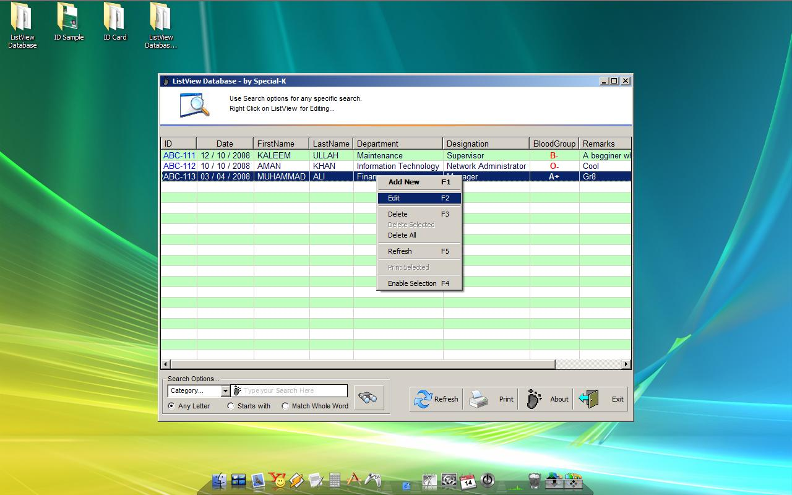



## Database Using ListView

### Description

Works nearly similar like an Access Database Table as it can Add, Edit, Find, Delete, Delete All, Delete Selected Records of ADODC connected Database.
 
### More Info
 

             |
---                |---
**Submitted On**   |2008-12-14 00:51:10
**By**             |[Special\-K](https://github.com/Planet-Source-Code/PSCIndex/blob/master/ByAuthor/special-k.md)
**Level**          |Advanced
**User Rating**    |4.7 (14 globes from 3 users)
**Compatibility**  |VB 6\.0
**Category**       |[Databases/ Data Access/ DAO/ ADO](https://github.com/Planet-Source-Code/PSCIndex/blob/master/ByCategory/databases-data-access-dao-ado__1-6.md)
**World**          |[Visual Basic](https://github.com/Planet-Source-Code/PSCIndex/blob/master/ByWorld/visual-basic.md)
**Archive File**   |[Database\_U21371012142008\.zip](https://github.com/Planet-Source-Code/special-k-database-using-listview__1-71527/archive/master.zip)

